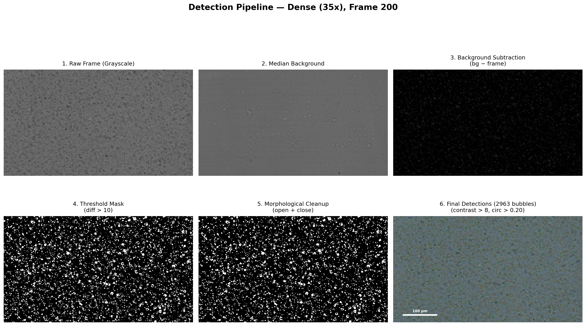

# MicroBubble Tracker

A tool for detecting, tracking, and measuring targeted microbubbles in
brightfield microscopy videos. It ships as a desktop GUI application built on a
headless tracking engine, so you can either point-and-click your way through an
analysis or script the same pipeline for batch processing.

The tracker follows each bubble the way a human eye does: it spawns tracks only
from high-confidence detections, then follows each bubble frame-by-frame with a
small image template (normalized cross-correlation), enforces physically
plausible motion, and splits tracks at acceleration spikes that signal a
mistrack. Results are calibrated to real-world units using the objective
magnification and exported as CSV, JSON, and publication-quality plots.



---

## Features

- **Drag-and-drop video loading** — analyze one or many videos in a session.
- **Per-video magnification** — 10x / 20x / 35x / 50x, with calibrated pixel-to-millimeter scaling.
- **Template-matching tracker** — median-background dark-bubble detection, NCC template following, velocity-based inertia enforcement, and automatic track splitting/merging.
- **Interactive review** — video player with track overlays, play/pause/scrub, plus track selection, deletion, and manual merging.
- **Measurements** — per-track path length, displacement, duration, mean radius, and mean/max velocity in physical units.
- **Export** — CSV, JSON, and plots (trajectories, velocity profiles, displacement-vs-time).

---

## Requirements

- **Python 3.9+**
- The Python packages listed in [`requirements.txt`](requirements.txt):
  `opencv-python`, `numpy`, `scipy`, `matplotlib`, `PyQt6`
- A working display (the GUI is a Qt desktop app). On Linux you may also need the
  usual Qt/X11 runtime libraries provided by your distribution.

---

## Setup

Clone the repo and install the dependencies into a virtual environment:

```bash
git clone https://github.com/jakerose17/targetedMicrobubbleMicroscopy.git
cd targetedMicrobubbleMicroscopy

python3 -m venv .venv
source .venv/bin/activate          # Windows: .venv\Scripts\activate

pip install -r requirements.txt
```

> **Note on sample videos:** the large `.mp4` sample clips are not stored in
> this repository (they are git-ignored to keep it lean). Supply your own
> microscopy video — any common format works (`.mp4`, `.avi`, `.mov`, `.mkv`,
> `.webm`, …).

---

## Running the app

Launch the GUI:

```bash
python microbubble_tracker.py
```

You can also preload one or more videos from the command line:

```bash
python microbubble_tracker.py video1.mp4 video2.mp4
```

### Typical workflow

1. **Add videos** — drag them onto the window, or use the CLI arguments above.
2. **Set the magnification** for each video (10x / 20x / 35x / 50x) so results are
   calibrated correctly.
3. **Run tracking** — the engine detects bubbles, follows them, and filters out
   static noise.
4. **Review** — scrub through the video with track overlays; delete spurious
   tracks or merge fragments by hand.
5. **Export** — save a CSV/JSON of the tracks and the summary plots.

---

## Scripting the engine (no GUI)

All detection, tracking, and export logic lives in
[`bubble_core.py`](bubble_core.py), which has no GUI dependencies and can be
imported directly for batch processing:

```python
from bubble_core import (
    BubbleTracker, DEFAULT_CONFIG, MAGNIFICATION_MAP,
    tracks_to_csv, tracks_to_json, generate_summary,
)

tracker = BubbleTracker(DEFAULT_CONFIG)
results = tracker.process_video("my_video.mp4")   # detect + track

px_per_mm = MAGNIFICATION_MAP["35x"]
print(generate_summary(results, px_per_mm, "35x"))
tracks_to_csv(results["moving_tracks"], results["fps"], px_per_mm, "tracks.csv")
```

Detection and tracking behavior is controlled by the `DEFAULT_CONFIG` dictionary
in [`bubble_core.py`](bubble_core.py) (background sampling, detection threshold,
template/search-window sizes, etc.) — copy it and override the values you want to
tune.

---

## Regenerating the pipeline figures

The annotated stage-by-stage figures under [`pipeline_figures/`](pipeline_figures)
illustrate each step of the detection and tracking pipeline on a sparse and a
dense example video. To regenerate them, place the two reference videos
(`testvid_lessDense_10x.mp4` and `testvid_dense_35x.mp4`) in the project root and
run:

```bash
python generate_pipeline_figures.py
```

The script writes its output back into `pipeline_figures/`. (The committed PNGs
are kept as a showcase; the source videos are not, so this step is optional.)

---

## Project layout

| Path | Description |
| --- | --- |
| `microbubble_tracker.py` | PyQt6 GUI application — the main entry point. |
| `bubble_core.py` | Headless detection/tracking/export engine (importable). |
| `generate_pipeline_figures.py` | Generates the annotated pipeline figures. |
| `pipeline_figures/` | Example pipeline-stage figures (committed showcase). |
| `requirements.txt` | Python dependencies. |

---

## License

No license file is currently included. Add one if you intend to share or
distribute this project.
